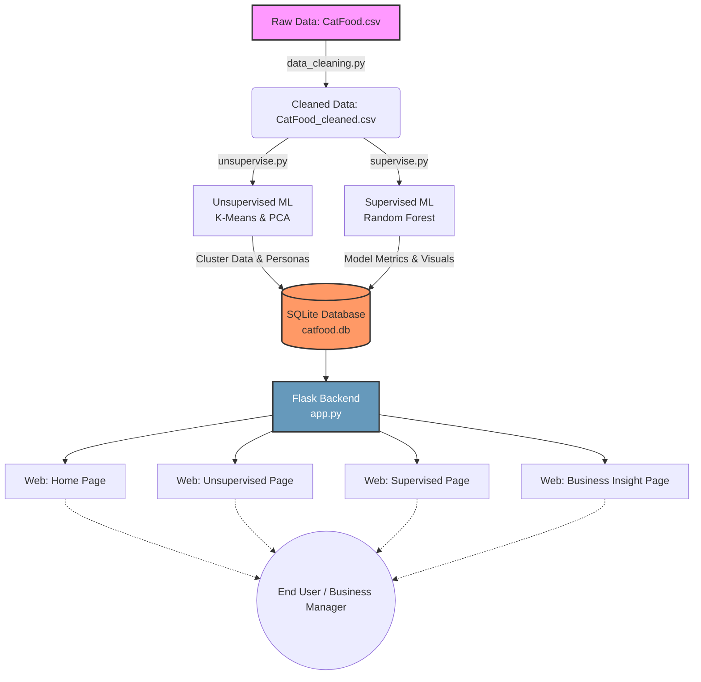

# เอกสารประกอบโครงงาน: AI Decision Support System for Cat Food Packaging
**วิชา: AIE322, AIE323, AIE324, AIE325**

เอกสารฉบับนี้รวบรวมเนื้อหาทั้ง 5 ส่วนที่เหลือ เพื่อใช้สำหรับส่งอาจารย์และทำสไลด์นำเสนอครับ

---

## 1. การวิเคราะห์ธุรกิจ (Business Understanding)

### Problem Statement (ปัญหาทางธุรกิจ)
ในตลาดอาหารแมวสำเร็จรูปที่มีการแข่งขันสูง "บรรจุภัณฑ์ (Packaging)" ถือเป็นหน้าต่างบานแรกที่สื่อสารกับผู้บริโภค อย่างไรก็ตาม แบรนด์และเอเจนซี่การตลาดมักประสบปัญหาในการตัดสินใจว่า "องค์ประกอบใดบนบรรจุภัณฑ์ (เช่น ภาพแมว, ภาพอาหารเม็ด, สัญลักษณ์ประโยชน์, หรือความพรีเมียม) ที่ส่งผลต่อการตัดสินใจซื้อมากที่สุด?" และ "ลูกค้าแต่ละกลุ่มมีความชอบที่แตกต่างกันอย่างไร?" การออกแบบที่ใช้เพียงสัญชาตญาณอาจทำให้สูญเสียโอกาสทางยอดขาย

### Business & AI Objective (วัตถุประสงค์)
เพื่อแก้ปัญหานี้ โครงงานนี้จึงนำเทคโนโลยี Machine Learning มาพัฒนาระบบ AI Decision Support System แบบ End-to-End โดยมีเป้าหมายเพื่อ:
1. **Unsupervised Learning:** ค้นหา Customer Persona และจัดกลุ่มลูกค้า (Segmentation) ตามพฤติกรรมการให้คะแนนความสำคัญของบรรจุภัณฑ์ เพื่อให้ทีมการตลาดสามารถทำ Targeted Marketing ได้แม่นยำขึ้น
2. **Supervised Learning:** สร้าง Predictive Model เพื่อทำนายว่า "บรรจุภัณฑ์มีผลต่อการตัดสินใจซื้อของลูกค้าคนนั้นๆ หรือไม่" (Binary Classification) และค้นหา Feature Importance ว่าปัจจัยใดสำคัญที่สุด
3. **Dashboard:** พัฒนาระบบ Web Application ที่ใช้งานได้จริง เพื่อนำเสนอ Business Insights ให้ทีมผู้บริหารตัดสินใจได้รวดเร็วและมีประสิทธิภาพ

---

## 2. รายงานการเตรียมข้อมูล (Data Preprocessing Report)

ข้อมูลชุดเริ่มต้นคือไฟล์ `CatFood.csv` ซึ่งเป็นผลลัพธ์จากการตอบแบบสอบถามดิบ โดยมีกระบวนการทำ Data Cleaning และ Preparation ดังนี้:

1. **Handling Headers & Corrupted Rows:** ลบ 4 แถวแรกที่เป็นเพียงคำอธิบาย (Brief) และลบแถวที่มีปัญหา Git Merge Conflict ออกจากชุดข้อมูล
2. **Data Filtering:** คัดกรองเอาเฉพาะผู้ตอบแบบสอบถามที่ "เคยซื้ออาหารแมว" เท่านั้น (ลบกลุ่มที่ตอบว่าไม่เคยซื้อออก) เนื่องจากเป็นกลุ่มเป้าหมายที่แท้จริง
3. **Variable Transformation & Encoding:** 
   - แปลงชื่อคอลัมน์จากภาษาไทยที่ยาวเยิ่นเย้อ ให้เป็นภาษาอังกฤษที่กระชับและเข้าใจง่าย (เช่น `pkg_premium`, `factor_taste`)
   - แปลงข้อมูลเชิงคุณภาพ (Categorical) ที่เป็น Likert Scale 5 ระดับ (มากที่สุด -> น้อยที่สุด, เห็นด้วยที่สุด -> ไม่เห็นด้วยเลย) ให้เป็นข้อมูลตัวเลข (Numeric: 5 -> 1) เพื่อให้ Machine Learning นำไปคำนวณได้
   - แปลงตัวแปรเป้าหมาย (Target Variable) คือ `packaging_influence` จาก (มีผล / ไม่มีผล) เป็น (1 / 0)
4. **Data Scaling:** ใช้ `StandardScaler` ในการปรับสเกลข้อมูลให้อยู่ในมาตรฐานเดียวกัน (Mean=0, Std=1) ก่อนนำไปเข้าโมเดล K-Means, PCA และ Logistic Regression
5. **Output:** ได้ไฟล์ `CatFood_cleaned.csv` ที่มีข้อมูลคุณภาพพร้อมสำหรับเทรนโมเดล (จำนวน 294 แถว)

---

## 3. เอกสารเหตุผลการเลือกโมเดล (Model Justification)

ในส่วนของ Supervised Learning (Classification) เพื่อทำนายว่า "บรรจุภัณฑ์มีผลต่อการตัดสินใจซื้อหรือไม่" เราได้ทำการเปรียบเทียบโมเดล 3 รูปแบบ ได้แก่ **Decision Tree**, **Random Forest** และ **Logistic Regression**

**ผลการประเมินประสิทธิภาพ (Model Performance):**
- **Decision Tree:** F1-Score = 0.7606, ROC-AUC = 0.729
- **Logistic Regression:** F1-Score = 0.7123, ROC-AUC = 0.670
- **Random Forest: F1-Score = 0.9136, ROC-AUC = 0.926 (ดีที่สุด 🏆)**

**เหตุผลในการเลือก Random Forest เป็นโมเดลหลัก (Justification):**
1. **ประสิทธิภาพสูงสุด:** Random Forest ให้ค่า F1-Score และ ROC-AUC สูงที่สุดอย่างมีนัยสำคัญ บ่งบอกถึงความสามารถในการแยกแยะ Class (มีผล vs ไม่มีผล) ได้แม่นยำที่สุด
2. **ความเสถียร (Robustness):** เมื่อทำการทดสอบ Cross-Validation (5-Fold) พบว่าค่า CV Accuracy ของ Random Forest สูงถึง 98.6% และมี Variance ต่ำ แสดงว่าโมเดลไม่มีปัญหา Overfitting เหมือนที่พบบ่อยใน Decision Tree แบบต้นเดียว
3. **Feature Importance:** Random Forest สามารถสกัดค่า Feature Importance ออกมาได้ดีเยี่ยม ทำให้เราสามารถตีความทางธุรกิจได้ชัดเจนว่าปัจจัยใด (เช่น `pkg_premium`, `factor_taste`) มีอิทธิพลต่อผลลัพธ์การทำนายมากที่สุด ตอบโจทย์ฝั่ง Business ได้เป็นอย่างดี

---

## 4. แผนภาพสถาปัตยกรรมระบบ (System Architecture)

ระบบถูกออกแบบในลักษณะ End-to-End Data Pipeline โดยสามารถแสดงเป็น Flowchart ได้ดังนี้:

*(หมายเหตุ: สามารถนำโค้ดด้านบนไปแปะในเว็บ https://mermaid.live เพื่อเซฟเป็นรูปภาพนำไปใส่สไลด์ได้ทันที)*

---

## 5. เค้าโครงสไลด์นำเสนอรอบสุดท้าย (Final Presentation Slide Deck)

**Slide 1: Title & Team**
- ชื่อโปรเจกต์: AI Decision Support System for Cat Food Packaging
- รายชื่อสมาชิกทีมและบทบาท (Business Analyst, Data Engineer, ML Engineer, Fullstack Developer)

**Slide 2: Business Problem & Objectives**
- ปัญหา: การออกแบบบรรจุภัณฑ์อาหารแมวมักใช้ความรู้สึก ไม่รู้ว่าอะไรดึงดูดลูกค้าจริง
- วัตถุประสงค์: นำ AI มาจัดกลุ่มลูกค้า, ทำนายการตัดสินใจซื้อ, และแสดงผลผ่าน Web Dashboard

**Slide 3: System Architecture Overview**
- อธิบายภาพรวมระบบ End-to-End Pipeline (ใช้ภาพจากข้อ 4)
- เทคโนโลยีที่ใช้: Python, Scikit-learn, SQLite, Flask, Chart.js

**Slide 4: Data Preparation**
- การทำความสะอาดข้อมูล (Data Cleaning)
- การแปลงข้อมูล Likert Scale ให้เป็น Numeric
- Feature Scaling

**Slide 5: Unsupervised Learning (AIE324 & AIE325)**
- โชว์กราฟ Elbow Method และ Silhouette Score สรุปว่าเลือก K=3
- โชว์กราฟ PCA (Dimensionality Reduction) ที่จัดกลุ่ม 3 คลัสเตอร์

**Slide 6: Customer Personas (ผลลัพธ์จาก Clustering)**
- สรุปลูกค้า 3 กลุ่ม:
  - Cluster 0 (11.6%): Moderate Engagement - เน้นธรรมชาติ (Natural)
  - Cluster 1 (52.7%): Moderate Engagement - เน้นรสชาติ (Taste)
  - Cluster 2 (35.7%): High Engagement - กลุ่มพรีเมียม ชอบบรรจุภัณฑ์ทุกรูปแบบ
  
**Slide 7: Supervised Learning (AIE322 & AIE323)**
- อธิบายโจทย์: ทำนายว่า "บรรจุภัณฑ์มีผลต่อการซื้อหรือไม่"
- โชว์ตารางเปรียบเทียบ Decision Tree, Random Forest, Logistic Regression
- โชว์กราฟ ROC Curve และ Confusion Matrix ของ Random Forest

**Slide 8: Model Justification**
- อธิบายเหตุผลที่เลือก Random Forest (ความแม่นยำ F1=0.91, CV คงที่, ลด Overfit)
- โชว์กราฟ Feature Importance เพื่อหาปัจจัยสำคัญ

**Slide 9: Web Application & Business Insights**
- โชว์ภาพ Screenshot ของหน้าเว็บ Dashboard ทั้ง 4 หน้า
- นำเสนอคำแนะนำทางธุรกิจ (Business Insight):
  - "สัญลักษณ์ประโยชน์ (Benefit Symbol) คือสิ่งที่สำคัญอันดับ 1 ที่ต้องมีบนซอง"
  - "ควรใช้ภาพแบบ Option 3 เพราะได้คะแนน Want-to-buy สูงสุด"

**Slide 10: Conclusion & Q&A**
- สรุปว่าระบบนี้ใช้งานได้จริงทางธุรกิจ และช่วยให้แบรนด์ลดความเสี่ยงในการออกแบบบรรจุภัณฑ์พลาดได้
